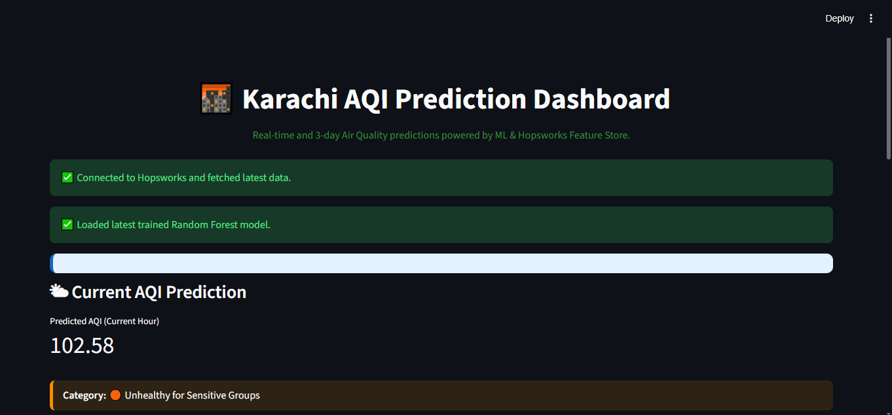
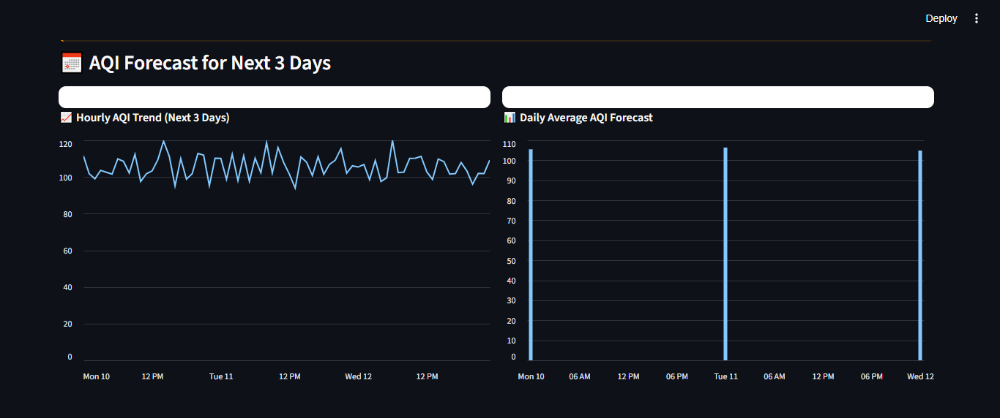
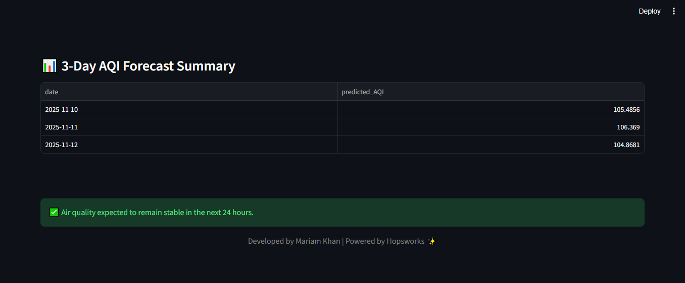

# 🌤️ Karachi AQI Prediction Bot

> **An end-to-end machine learning pipeline for real-time air quality forecasting using Open-Meteo APIs, Hopsworks Feature Store, and Streamlit.**


---

## 🧭 Project Overview

The **Karachi AQI Prediction Bot** is a fully automated air quality prediction system that forecasts AQI for the **current day and next three days**.  
It integrates data from **Open-Meteo’s Air Quality and Weather APIs**, computes pollutant-based AQI following **U.S. EPA standards**, and continuously updates the data pipeline through **GitHub Actions CI/CD**.

The system automates every stage — from **data ingestion and feature engineering** to **model training, prediction, and visualization** — while storing all processed data in the **Hopsworks Feature Store**.

---

## 🧩 Technologies Used

- 🧰 **Python** (Pandas, NumPy, Scikit-learn, XGBoost)  
- ☁️ **Hopsworks Feature Store**  
- 🌤️ **Open-Meteo APIs** (Air Quality, Weather Forecast, Historical Archive)  
- ⚙️ **GitHub Actions** (Automated CI/CD)  
- 📊 **Streamlit Dashboard**  

---

## ⚙️ Key Features

✅ Real-time data fetching from Open-Meteo APIs  
✅ Scientific AQI computation using U.S. EPA (2016) methodology  
✅ Automated cleaning, feature generation, and upload to cloud Feature Store  
✅ Daily CI/CD pipelines for ingestion and model retraining  
✅ Streamlit dashboard for AQI visualization and forecast  
✅ Modular, scalable, and production-ready Python architecture  

---

## 🧩 System Architecture

    +---------------------+
    |  Open-Meteo APIs    |
    | (Air + Weather Data)|
    +----------+----------+
               |
               v
    +---------------------+
    | Data Processing &   |
    | Feature Engineering |
    +----------+----------+
               |
               v
    +---------------------+
    | Hopsworks Feature   |
    |       Store         |
    +----------+----------+
               |
               v
    +---------------------+
    |  Model Training &   |
    |   Evaluation        |
    +----------+----------+
               |
               v
    +---------------------+
    | Streamlit Dashboard |
    |  (3-Day Forecast)   |
    +---------------------+


---

## 📁 Folder Structure

```bash
AQI Prediction Bot/
│
├── .github/
│ └── workflows/
│ ├── feature_pipeline.yml # Daily feature ingestion pipeline
│ └── training_pipeline.yml # Daily model retraining pipeline
│
├── data/ # Local data folders (disabled in CI mode)
│
├── models/
│ └── best_model_random_forest.pkl # Final trained model
│
├── notebooks/
│ ├── 01_eda_preprocessing.ipynb # EDA Phase 1 (data cleaning + outliers)
│ └── 02_eda_feature_analysis.ipynb # EDA Phase 2 (feature correlation)
│
├── reports/
│ └── Final Report.pdf
├── src/
│ ├── aqi_utils.py # EPA-based AQI computation
│ ├── backfill_data.py # Historical data (1 year) fetching
│ ├── clean_data.py # Cleans raw merged dataset
│ ├── config.py # Configuration (API URLs, paths)
│ ├── fetch_data.py # Fetches air + weather data
│ ├── process_data.py # Converts raw JSON to DataFrame
│ ├── process_features.py # Feature engineering and selection
│ ├── merge_features.py # Merges pollutant and weather data
│ ├── upload_to_hopswork.py # Uploads data to Hopsworks Feature Store
│ ├── run_feature_pipeline.py # Orchestrates end-to-end feature pipeline
│ ├── train_model.py # Trains Ridge, RF, and XGBoost models
│ └── predict_evaluate.py # Forecasts next 3-day AQI
│
├── streamlit_app/
│ ├── app.py # Streamlit frontend
│ └── utils.py # Helper functions 
│
├── .env # Contains HOPSWORKS_API_KEY (hidden on git)
├── requirements.txt # Project dependencies
├── run_frontend.bat # Script to launch frontend locally
└── README.md # Documentation
```

---

## 📊 Data & Methodology

**Data Source:** [Open-Meteo Air Quality & Weather APIs](https://open-meteo.com/)  
**Reference Document:** *U.S. EPA Technical Assistance Document for Reporting AQI (May 2016)*  
**Pollutants Used:** PM₂.₅, PM₁₀, NO₂, CO, SO₂, O₃  
**Weather Parameters:** Temperature, Humidity, Wind Speed, Wind Direction  

### 🧮 AQI Computation  
Each pollutant’s AQI is computed using EPA’s official breakpoint interpolation formula.  
The overall AQI = **max(sub-indexes)** per hour.

---

## 🔄 Project Phases Summary

### **1️⃣ Data Collection**
- APIs:  
  - `air-quality-api.open-meteo.com`  
  - `api.open-meteo.com/v1/forecast`  
  - `archive-api.open-meteo.com/v1/archive`  
- Combined hourly pollutant + weather data (Karachi coordinates).  
- Backfilled **1-year historical data** for initial training.

---

### **2️⃣ EDA & Data Cleaning**
- Detected and capped extreme outliers (1–99 percentile).
- Removed duplicates and filled missing values (forward/backward fill).
- Retained valid NO₂ peaks as real events.
- PM₂.₅ and PM₁₀ found to be **strongest AQI drivers**.
- Winter → high pollutant buildup; Summer → dusty PM₁₀ spikes.
- Verified via correlation and seasonal trend analysis.

---

### **3️⃣ Feature Engineering**
- Generated **time-based**, **cyclic**, and **ratio-based** features.
- Added derived metrics:
  - `aqi_change_rate`
  - `aqi_lag_1h`
  - `pm_ratio`
  - `temp_humidity_ratio`
  - `wind_effect`
- Added binary `high_pollution_flag` for classification-based alerting.
- Final selected feature count: **23**

---

### **4️⃣ Cloud Integration (Hopsworks Feature Store)**
- Created **Feature Group:** `aqi_features_v1`
- Online-enabled for daily ingestion and model training.
- Appends **current day’s hourly data** daily via GitHub Actions.

---

### **5️⃣ Model Training & Evaluation**
- Models: **Ridge Regression, Random Forest, XGBoost**
- Rolling and lag features removed to prevent data leakage.
- Added ±5% Gaussian noise to pollutant data for realism.
- Random Forest performed best:
  - 🧾 **Train RMSE:** 3.91  
  - 🧾 **Test RMSE:** 6.59  
  - 🧾 **R²:** 0.99  
- Model saved as `best_model_random_forest.pkl`

---

### **6️⃣ CI/CD Automation**
| Pipeline | Schedule | Purpose |
|-----------|-----------|----------|
| `feature_pipeline.yml` | 🕗 **8:10 AM PKT (03:10 UTC)** | Fetches new data & uploads to Hopsworks |
| `training_pipeline.yml` | 🕣 **8:30 AM PKT (03:30 UTC)** | Retrains ML model on updated data |

Both workflows run automatically via **GitHub Actions**, ensuring **daily data and model freshness**.

---

### **7️⃣ Frontend Dashboard (Streamlit)**
- Predicts AQI for **current + next 3 days**
- Visualizations:
  - **Bar Chart:** Average AQI for next 3 days
  - **Line Chart:** Hourly AQI variation
  - **Status Display:** Good, Moderate, Unhealthy, etc.
- AQI categories based on EPA breakpoints:

| AQI Range | Category | Color |
|------------|-----------|-------|
| 0–50 | Good | 🟢 |
| 51–100 | Moderate | 🟡 |
| 101–150 | Unhealthy (Sensitive) | 🟠 |
| 151–200 | Unhealthy | 🔴 |
| 201–300 | Very Unhealthy | 🟣 |
| 301–500 | Hazardous | ⚫ |

 


---

## 🧰 Setup Guide

### 
```bash
1️⃣ Clone Repository
git clone https://github.com/yourusername/aqi-prediction-bot.git
cd aqi-prediction-bot

2️⃣ Create Virtual Environment
python -m venv venv
source venv/bin/activate        # macOS/Linux
venv\Scripts\activate           # Windows

3️⃣ Install Dependencies
pip install -r requirements.txt

4️⃣ Configure Environment

Create a .env file:

HOPSWORKS_API_KEY=your_api_key_here
SAVE_LOCAL=false

5️⃣ Run Feature Pipeline
python src/run_feature_pipeline.py

6️⃣ Train Model
python src/train_model.py

7️⃣ Run Streamlit Dashboard
cd streamlit_app
streamlit run app.py


```
---

## 📈 Results Snapshot

| Model | RMSE (Test) | R² | Remarks |
|--------|--------------|----|----------|
| Ridge Regression | 10.4 | 0.93 | Linear baseline |
| XGBoost | 7.9 | 0.97 | High accuracy but overfit risk |
| **Random Forest** | **6.59** | **0.99** | ✅ **Best performer** |

---

## 🧾 Feature Store Verification

> “Hopsworks automatically reorders uploaded feature data chronologically by primary key (timestamp),  
> which initially appeared as a data mismatch; this was verified through data-order checks before and after upload.”

---

## 💻 Future Enhancements

- 🧠 Add **SHAP-based interpretability** (`lime_analysis.py` placeholder ready)  
- 🌆 Expand to multiple cities (Lahore, Islamabad, Delhi)  
- ☁️ Enable **Streamlit Cloud** / **HuggingFace Spaces** deployment  
- 📱 Introduce **SMS / Email AQI Alerts** for high-pollution warnings  

---

## 👩‍💻 Author

**Mariam Khan**  
🎓 *B.S. Computer Science — Internship Project*  
📍 *Karachi, Pakistan*  
📧 [LinkedIn Profile](www.linkedin.com/in/mariam-khan0424)

---

## 📜 License

This project is licensed under the **MIT License** — feel free to use and modify with attribution.
